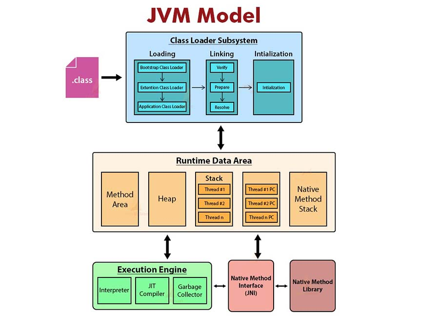

+ [3. Runtime - Compiletime](#3-runtime---compile-time)  
+ [4. JVM](#4-jvm)  
+ [5. JDK - JRE](#5-jdk---jre)  
+ [6. Compiler - Interpreter](#6-compiler---interpreter)  
+ [7. Open JDK - Oracle JDK](#7-open-jdk---oracle-jdk)  
+ [8. JAVA_HOME](#8-javahome)    
+ [9. Java SE - Java ME - Java EE](#9-java-se---java-me---java-ee)  
+ [10. Unicode in Java](#10-unicode-in-java)  


## 3. Runtime - Compile time  

- **Question**:  
    + Phân biệt giữa Runtime và Compile?  
    + Các exception có thể xảy ra?  

Compile time & Runtime là 2 giai đoạn trong quá trình phát triển chương trình phần mềm, trong đó:  

- Compile-time: là khoảng thời gian chuyển đổi source code (mã nguồn) được thành mã máy.  
- Runtime: là khoảng thời gian thực thi chương trình.  

Lỗi xảy ra tại Compile-time & Runtime:  

- Compile-time: Được phát hiện bởi compiler mà không thực thi chương trình.  
- Runtime: Được phát hiện trong khi thực thi chương trình.  

Compile-time & Runtime đề cập đến các loại lỗi khác nhau:  

- Compile-time:  
    - Syntax errors (lỗi cú pháp): xảy ra do source code được viết sai cú pháp,  
    - Semantic errors (lỗi ngữ nghĩa): xảy ra do type checking.  

- Runtime:  
    - Division by zero (chia cho 0): xảy ra khi chia 1 số cho 0,  
    - Dereferencing a null pointer (tham chiếu tới con trỏ null): xảy ra khi cố gắng truy cập bộ nhớ với NULL,  
    - Running out of memory (tràn bộ nhớ): xảy ra khi máy tính không có bộ nhớ cấp phát cho chương trình.  
    - Hay cố gắng mở file không tồn tại.  


## 4. JVM  

- **Question**:  
    + Chi tiết khái niệm, luồng, xử lý, thành phần, ứng dụng:  
    + Class Loader : Bootstrap Loader / Extension Loader / System Loader?  
    + Class Loader : Cách thức hoạt động khi load bắt đầu từ main?  
    + Class Loader : java.lang.ClassLoader, Exception?  
    + JVM Memory: Method area, Stack, Heap, PC register, Native Method Stack?  
    + JVM Memory: Exception xảy ra với Stack và Heap?  
    + JVM Excute engine: GC, JIT, Interpreter, Compiler?  

- **Requirements**:  
    + Hiểu khái niệm, các hoạt động, có thể vẽ lại được mô hình hoạt động,  
    + Có thể viết 1 chương trình Java đơn giản và phân tích mã nguồn được xử lý như thế nào trong JVM.  

### 4.1, Định nghĩa  

JVM (Java Virtual Machine - máy ảo java):  

- là một engine cung cấp môi trường & thực thi Java bytecode,  
- là một thành phần của JRE (Java Runtime Environment).  

JVM phụ thuộc vào platform (HĐH), các platform khác nhau sẽ cài JVM tương ứng dành cho platform đó, chúng đều có cơ chế hoạt động tương tự nhau, nhờ đó Java code không phụ thuộc platform có thể thực thi trên các platform khác nhau.  

>                 (javac)                 (interpreter)
> Source code --- Compiler ---> Byte code --- JVM ---> Machine code for platform
> (.java file)                  (.class file)

### 4.2, Hoạt động  

> Class Loader --> Byte Code Verifier --> Execution Engine  

JVM thực hiện các hoạt động sau:  

- Loads code  
- Verifies code  
- Executes code  
- Provides a runtime environment  

### 4.3, Kiến trúc  

  
  

Sơ đồ **Java Runtime System**:  
                                        
>  classes ----->  Class Loader Subsystem (1)  
>                       ^
>                       |
>                       v
> --- Runtime Data Area -----------------------
> |                                           |
> | Method  Heap  JVM       PC         Native |
> | Area          Language  Registers  Method |
> |               Stacks               Stacks |
> | (2)     (3)   (4)       (5)        (6)    |
> ---------------------------------------------
>     ^
>     |
>     v
> Execution         Native          Native
> Engine     <--->  Method   <--->  Method
>                   Interface       Libraries
>  (7)               (8)             (9)  


Kiến trúc của JVM được chia làm 3 sub-system chính:  

- Class-Loader Subsytem: Loads các file .class vào vùng nhớ của JVM.  
- Runtime Data Area: vùng nhớ hệ thống cấp phát cho JVM.  
- Execution Engine: phân tích, xử lý & thực thi bytecode.  

#### 4.3.1, Class Loader Subsystem  

*Class Loader Subsystem* có nhiệm vụ loads các .class files vào JVM memory, ngoài ra nó còn chịu trách nhiệm định vị tài nguyên dựa trên đường dẫn.  

Class Loader Subsystem thực hiện 3 chức năng chính: Loading, Linking, & Initialization.  

> Loading --> Linking --> Initialization  

##### *4.3.1.1, Loading*  

*Loading*: Xử lý việc loads các class files, được thực hiện bởi các class loader.  

Class loader là một object chịu trách nhiệm tải các class thông qua class name.  

Có 3 built-in class loader bao gồm:  

- **Bootstrap Class Loader**:  
    + Được viết bởi native code (C/C++).  
    + Không có Parent Class Loader, là Parent của Extension Class Loader.  
    + Thực hiện loads các class files của Java core nằm trong rt.jar & một số core libraries khác đặt trong thư mục $JAVA_HOME/jre/lib, (các class files của các packages: java.lang, java.util, java.io, java.sql, ...).  
- **Extension Class Loader**:  
    + Là Child Của Boostrap Class Loader & Parent của System Class Loader.  
    + Thực hiện loads các extension class files của Java core được đặt trong các thư mục được trỏ bởi system property java.ext.dirs, mặc định bao gồm thư mục $JAVA_HOME/jre/lib/ext.  
- **System / Application Class Loader**:  
    + Là Child của Extension Class Loader.  
    + Thực hiện loads các class files mức ứng dụng từ system classpath được chỉ định bởi java.class.path (mặc định là thư mục hiện tại, hoặc có thể set classpath khi chạy chương trình bằng command line option -cp hay -classpath hay set biến môi trường CLASSPATH).  

Class Loader hoạt động dựa trên 3 nguyên tắc:  

- **Delegation principle** (nguyên tắc ủy quyền): Trừ Bootstrap Class Loader, mọi Class Loader đều có Parent. Khi load một class, Class Loader sẽ ủy quyền tìm kiếm cho Parent Class Loader, nó chỉ cố gắng tìm kiếm nếu Parent không tìm thấy class đó.  
- **Visibility principle** (nguyên tắc hiển thị): Child Class Loader có thể thấy tất cả các class được load bởi Parent. Nhưng Parent Class Loader không thể thấy các class được load bởi Child Class Loader.  
- **Uniqueness principle** (nguyên tắc duy nhất): Mỗi class chỉ được load một lần duy nhất, đảm bảo rằng Child Class Loader không tải lại class đã được tải bởi Parent.  

*Cách thức hoạt động*: Khi JVM yêu cầu load một class:  

- Class Loader Subsystem thực hiện:  
    + Ủy quyền yêu cầu cho Child Class Loader cuối cùng,  
    + Class loader này sẽ kiểm tra class đã được load hay chưa, nếu đã được load sẽ trả lại class, nếu chưa được load sẽ ủy quyền cho Parent, nếu Parent không tìm được thì nó mới cố gắng tìm kiếm, quá trình này diễn ra đệ quy.  
    + Nếu Child Class Loader cuối cùng vẫn không thấy class, một ngoại lệ *java.lang.ClassNotFoundException* sẽ được ném ra.  
- Sau khi class file được load vào Method Area, JVM sẽ tạo 1 object là instance của *java.lang.Class* để đại diện cho class file này trong *heap*, các class được load sẽ tham chiếu đến class loader đã load nó.  

*java.lang.ClassLoader* là abstract class nằm trong package *java.lang* của Java core:  

- Constructors trong *java.lang.ClassLoader* & các subclass của nó cho phép khởi tạo class loader, mặc định Parent của class loader được tạo sẽ là System Class Loader, hoặc có thể chỉ định Parent khi khởi tạo.  
- Khi gọi method *loadClass* của *ClassLoader* để load class, theo thứ tự sẽ thực hiện:  
    + gọi method *findLoadedClass* để kiểm tra xem class đã được load hay chưa,  
    + Nếu class đã được load, trả về class,  
    + Nếu class chưa được load, ủy quyền cho Parent Class Loader,  
    + Nếu Parent tìm không thấy class, gọi method *findClass* để tìm & load class.  
- Class *java.net.URLClassLoader* đóng vai trò là Basic Class Loader cho các phần extension và các JAR file khác, ghi đè method *findClass* của *java.lang.ClassLoader* để tìm kiếm một hoặc nhiều URL được chỉ định cho các class và tài nguyên.  

##### *4.3.1.2, Linking*

*Linking*: Xử lý verify byte code & liên kết các class hoặc interface.  

Nó thực hiện 3 hoạt động quan trọng:  

- **Verification**:  
    + Bytecode Verifier xác thực class file có hợp lệ hay không nhằm nâng cao tính bảo mật,  
    + Ngoại lệ *java.lang.VerifierError* sẽ được ném ra nếu không hợp lệ về cấu trúc or được tạo bởi compiler không hợp lệ,  
- **Preparation**:  
    + JVM cấp phát bộ nhớ cho static variables ở cấp độ class hoặc interface (các static fields), gán cho chúng giá trị mặc định,  
    + Ngoại lệ *java.lang.OutOfMemoryError* sẽ được ném ra nếu bộ nhớ không có sẵn để cấp phát.  
- **Resolution**:  
    + Xác định các original memory reference (tham chiếu bộ nhớ nguyên thủy - địa chỉ bộ nhớ thực) từ các symbolic memory reference (tham chiếu tượng trưng - các tên định danh) trong *Runtime Constant Pool* để liên kết với các class & interface khác mà nó phụ thuộc vào,  
    + Ngoại lệ *java.lang.LinkageError* or subclass của nó sẽ được ném ra nếu xảy ra không tương thích.   

##### *4.3.1.3, Initialization*

*Initialization*: Xử lý việc gán giá trị ban đầu cho các static variables, & thực thi các static blocks.  

#### 4.3.2, Runtime Data Area  

*Runtime Data Area* được chia làm 5 components chính:  

- Method Area,  
- Heap,  
- Stack,  
- PC Register,  
- Native Method Stack.  

##### *4.3.2.1, Method Area*  

*Method Area* lưu trữ thông tin cấu trúc của các class:  

- Runtime Constant pool (chứa các constant, các symbolic references là tên của variables, methods, classes & interfaces trong mỗi class file),  
- Field & method data,  
- Code for Methods & Constructor,  
- Direct Super Class,  
- Direct Super Interfaces,  
- Modifiers,  

Method Area được tạo khi khởi động JVM, được chia sẻ giữa tất cả các luồng.  

Nếu Method Area không có sẵn để đáp ứng yêu cầu cấp phát bộ nhớ thì ngoại lệ *java.lang.OutOfMemoryError* sẽ được ném ra.  

##### *4.3.2.2, Heap*  

*Heap* lưu trữ tất cả các class instances, arrays còn các reference đến chúng sẽ được lưu trong Stack.  

Nếu objects được lưu trên heap không có tham chiếu, bộ nhớ cho object đó sẽ bị thu hồi bởi *garbage collector*.  

Heap được tạo khi khởi động JVM, được chia sẻ giữa tất cả các luồng, vì vậy dữ liệu trên heap là *not thread-safe*.  

Nếu Heap không có sẵn để đáp ứng yêu cầu cấp phát bộ nhớ thì ngoại lệ *java.lang.OutOfMemoryError* sẽ được ném ra.  

##### *4.3.2.3, Stack*  

Mỗi JVM Thread có một JVM Stack riêng được tạo cùng lúc với Thread, một thread không thể truy xuất & thay đổi dữ liệu trong Stack của thread khác.  

*Stack* chứa các Frames, khi luồng gọi một method thì JVM sẽ tạo một frame & đẩy vào đỉnh của Stack; khi method hoàn tất thì JVM sẽ đẩy frame ra khỏi Stack & xóa bỏ.  

Stack Frame lưu trữ các tham số, biến cục bộ, các phép tính trung gian và các dữ liệu khác.  

Cấu trúc của Stack Frame bao gồm:  

- *Local Variable Array* (mảng biến cục bộ): Chứa các local variables & parameters của method,  
- *Operand Stack* (ngăn xếp toán hạng): Là không gian làm việc của JVM, các toán hạng sẽ được đẩy vào *Operand Stack*, sau đó các lệnh sẽ lấy các toán hạng từ ngăn xếp toán hạng, thao tác trên chúng & đẩy kết quả trở lại ngăn xếp toán hạng.  
- *Frame data*: Chứa các thông tin hỗ trợ phân giải Constant Pool, Trả về giá trị thông thường & Điều phối ngoại lệ như:  
    + *Constant Pool Reference*: Là tham chiếu đến *Runtime Constant Pool* của class chứa method hiện tại trong *Method Area*.  
    + *Exception Table Reference*: Là tham chiếu đến bảng ngoại lệ của method.  

Các Exceptions có thể xảy ra:  

- Nếu quá trình xử lý Thread yêu cầu bộ nhớ quá giới hạn cho phép, ngoại lệ *StackOverFlowError* sẽ được ném ra.  
- Nếu không có đủ bộ nhớ để cung cấp Stack cho thread mới, thì ngoại lệ *OutOfMemoryError* sẽ được ném ra.  

Một method có thể hoàn thành theo một trong hai cách:  

- Hoàn thành bình thường bằng cách trả về.  
- Hoàn thành đột ngột bằng cách ném một ngoại lệ.  

Nếu một method hoàn thành bình thường (bằng cách trả về), JVM phải khôi phục Stack frame của method đang gọi, thiết lập PC Register trỏ đến câu lệnh phía sau lệnh gọi method hoàn thành trong method đang gọi. Nếu method hoàn thành trả về một giá trị, JVM phải đẩy giá trị đó vào ngăn xếp toán hạng của frame hiện tại.  

Nếu một method hoàn thành đột ngột (bằng cách ném một ngoại lệ), JVM sử dụng Exception Table Reference để xác định cách xử lý ngoại lệ. Nếu JVM tìm thấy mệnh đề catch phù hợp trong Exception Table, nó sẽ chuyển quyền điều khiển cho mệnh đề catch đó. Nếu JVM không tìm thấy mệnh đề catch phù hợp, method này sẽ hoàn thành đột ngột. JVM sử dụng thông tin trong Frame data để khôi phục Frame của method đang gọi. Sau đó, nó sẽ ném lại cùng một ngoại lệ trong ngữ cảnh của method đang gọi.

##### *4.3.2.4, PC Register*  

Mỗi JVM Thread có một PC Register (Program Counter Register) riêng được tạo cùng lúc với Thread.  

*PC Register* chứa địa chỉ dòng lệnh mà luồng đang thực thi, Nếu method đang được thực thi là native method thì *PC Register* chứa giá trị undefined.  

##### *4.3.2.5, Native Method Stack*  

Mỗi JVM Thread có một Native Method Stack riêng được tạo cùng lúc với Thread.  

*Native Method Stack* tương tự với Stack, nó chứa các data element để hỗ trợ thực thi các native methods.  

Nếu không đủ bộ nhớ để cấp Native Method Stack cho Thread được tạo, ngoại lệ *OutOfMemoryError* sẽ được ném ra.  

#### 4.3.3, Execution Engine

*Execution Engine* đọc dữ liệu từ *Runtime Data Area* để thực thi Byte code.  

Execution Engine gồm 3 components chính:  

- **Interpreter**: Đọc, diễn giải byte code, & thực thi chúng một cách tuần tự. Nhược điểm là khi 1 method được gọi nhiều lần, mỗi lần gọi method đó sẽ lại được thông dịch lại.  
- **JIT Compilier** (Just-In-Time Compiler): Khắc phục nhược điểm của *Interpreter*, biên dịch byte code đượi gọi lại nhiều lần sang native code giúp cải thiện hiệu suất.  
- **Garbage Collector**: Thực hiện thu thập các object không còn được tham chiếu giúp giải phóng bộ nhớ.  

#### 4.3.4, Native Method Interface (JNI)  

*Native Method Interface* đóng vai trò là giao diện tương tác với libraries & ứng dụng khác, nó thực hiện:  

- Cung cấp các Native Libraries cần thiết cho *Execution Engine*,  
- Gửi output tới Console hoặc cho phép các Libraries gọi Java code đang được thực thi trong JVM.  

#### 4.3.5, Native Method Libraries  

*Native Method Libraries* là một tập các Native Libraries (C/C++) cần thiết cho *Execute Engine*.  

### 4.4, Cách thức hoạt động của JVM từ *main* method

```java
public class Main {
    public static void main(String[] args) {
        Student student = new Student();
        student.study();
    }
}
```

- Chương trình bắt đầu từ *main* method.  
- Trước khi thực thi *main* method, JVM thực hiện:  
    + Tạo main thread, cấp phát runtime data area gồm *PC Register*, *JVM Stack*, *Native Method Stack* cho main thread.  
    + Load class của *main* method, & khởi tạo static resources của class (lưu trữ tại constant pool).  
    + Tạo frame mới cho *main* method trong *JVM Stack* & cấu trúc cho frame.  
    + Cập nhật *PC Register* tham chiếu đến dòng lệnh đầu tiên của *main* method.  
- JVM thực thi dòng lệnh được tham chiếu bởi *PC Register* của Main Thread.  
- Khi tạo một class instance, JVM thực hiện:  
    + Load class được gọi để khởi tạo instance, & khởi tạo static resources của nó.  
    + Tạo object mới trong *Heap* & tạo các members của nó.  
    + Tạo reference lưu trong *Stack* tới object vừa tạo trong *Heap*.  
- Khi gọi method, JVM thực hiện:  
    + Tạo frame mới cho method được gọi & đẩy vào đỉnh của *Stack*, frame này sẽ trở thành current frame.  
    + Cập nhật *PC Register* tham chiếu đến dòng lệnh của method được gọi.  
    + Thực thi dòng lệnh được tham chiếu bởi *PC Register*.  
    + Khi method được hoàn thành dù bình thường hay đột ngột, frame sẽ bị xóa bỏ khỏi *Stack*, khôi phục Frame của method hiện tại thành current frame, sau đó:  
        + Nếu hoàn thành bình thường, JVM sẽ cập nhật *PC Register* tham chiếu đến dòng lệnh sau lệnh gọi method hoàn thành.  
        + Nếu hoàn thành đột ngột, JVM sẽ ném lại cùng một ngoại lệ trong ngữ cảnh của method đang gọi.  


## 5. JDK - JRE  

### 5.1, JDK

JDK (Java Development Kit) là bộ công cụ phần mềm cung cấp môi trường phát triển & chạy các chương trình Java.  

*Note*: JDK là triển khai của Java platform  

JDK cho phép phát triển & thực thi các chương trình Java.  

JDK bao gồm:  

- JRE  
- Các công cụ phát triển như Compiler, Debugger, ...  

> JDK = JRE + Development tools (Compiler + Debugger)

### 5.2, JRE

JRE (Java Runtime Environment) là bộ công cụ phần mềm cung cấp môi trường thực thi cho các chương trình Java.  

JRE là một thành phần của JDK.  

JRE cho phép chạy các chương trình Java.  

JRE bao gồm:  

- JVM  
- Các class libraries cần thiết để thực thi chương trình

> JRE = JVM + Libraries  


## 6. Compiler - Interpreter  

Compiler (trình biên dịch):  

- Là một chương trình máy tính giúp chuyển đổi mã nguồn bậc cao (source code) thành mã máy (machine code).  
- Hiển thị tất cả các lỗi trong toàn bộ chương trình.  
- Chương trình được thực thi sau khi quá trình biên dịch hoàn tất mà không có lỗi.  

> Source code --- Compiler ---> Machine code ----> Output

Interpreter (trình thông dịch):  

- Là chương trình máy tính giúp chuyển đổi từng câu lệnh của chương trình bậc cao (source code, pre-compiled code & scripts) thành mã máy (machine code).  
- Hiển thị lỗi của dòng lệnh, nếu có lỗi sẽ ngừng thông dịch.  
- Chương trình được thực thi từng câu lệnh ngay sau khi câu lệnh đó được thông dịch hoàn tất.  

> Source code --- Interpreter ---> Output  


## 7. Open JDK - Oracle JDK  

Open JDK:  

- Là mã nguồn mở,  
- Được phát triển bởi Oracle, đồng thời có sự đóng góp của cộng đồng,  
- Chỉ hỗ trợ trong thời gian phiên bản đó được phát hành cho đến khi có phiên bản mới.  

Oracle JDK:  

- Không mở mã nguồn,  
- Được phát triển bởi Oracle,  
- Hỗ trợ dài hạn cho các phiên bản được phát hành,  
- Hiệu năng & khả năng đáp ứng tốt hơn so với Open JDK,  


## 8. JAVA_HOME  

JAVA_HOME là một biến môi trường (Environment variable) được thiết lập để hỗ trợ hệ điều hành tìm đến các công cụ của JDK sử dụng khi phát triển & thực thi ứng dụng,  

Nó là một quy ước, nếu không set biến JAVA_HOME thì có thể thiết lập PATH của hệ điều hành trực tiếp trỏ đến thư mục chứa các công cụ của JDK, chính là thư mục jdk/bin.  


## 9. Java SE - Java ME - Java EE  

Java SE, Java ME, Java EE đều là các Java Platforms (nền tảng Java) dành cho mục đích phát triển khác nhau, trong đó:  

- Java SE (Java Standard Edition):  
    + Là phiên bản cơ bản của Java, được dùng làm nền tảng cho các phiên bản khác,  
    + Được sử dụng chủ yếu để tạo các ứng dụng cho môi trường Desktop.  
- Java ME (Java Micro Edition):  
    + Là phiên bản Micro (vi mô) của Java,  
    + Được sử dụng chủ yếu để tạo các ứng dụng chạy trên các hệ thống nhúng hạn chế về tài nguyên như thiết bị di động và các thiết bị nhỏ khác,  
- Java EE (Java Enterprise Edition):  
    + Là phiên bản Doanh Nghiệp của Java,  
    + Được sử dụng chủ yếu để tạo server,  

Các ứng dụng của Java:  

- Xây dựng website,  
- Phát triển game,  
- Phát triển ứng dụng Desktop,  
- Phát triển ứng dụng Android,  
- Xây dựng ứng dụng nhúng,  
- ...  


## 10. Unicode in Java

Unicode là một bộ ký tự chuẩn quốc tế, nó bao gồm tất cả các ký tự từ tất cả các ngôn ngữ trên thế giới, mỗi ký tự có một giá trị số duy nhất.  

Trong Unicode, kích thước của mỗi ký tự là 2 byte.  

Java sử dụng bộ ký tự Unicode.  
