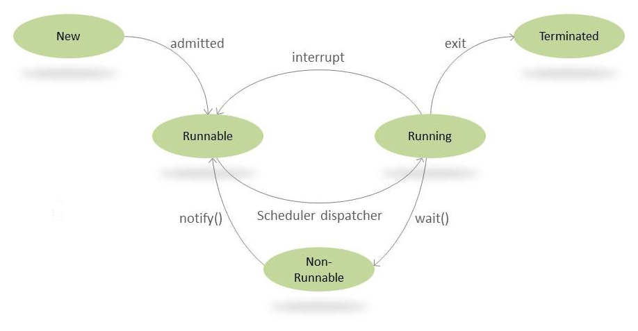

# Lession 3. Concurrency

## 3. wait() và notify()

### *3.1, Thread Synchronization*

Trong môi trường đa luồng, nhiều thread có thể cố gắng sửa đổi cùng một tài nguyên. Không quản lý các threads đúng cách tất nhiên sẽ dẫn đến các vấn đề về tính nhất quán.

Ngoài join(), một công cụ chúng ta có thể sử dụng để điều phối các hành động của nhiều threads trong Java là các *guarded blocks*, chúng luôn kiểm tra một điều kiện cụ thể trước khi tiếp tục thực thi.  

Với ý nghĩ đó, chúng ta sẽ sử dụng:

- *Object.wait()* để tạm ngưng một thread,  
- *Object.notify()* để đánh thức một thread.  

Chúng ta có thể hiểu rõ hơn điều này từ sơ đồ mô tả: .


### *3.2, The wait() Method*

Nói một cách đơn giản, việc gọi *wait()* buộc thread hiện tại phải đợi cho đến khi một số thread khác gọi *notify()* hoặc *notifyAll()* trên cùng một object.  

Hay, thread hiện tại phải sở hữu monitor của object. Theo Javadocs, điều này có thể xảy ra theo những cách sau:  

- khi chúng ta đã thực thi synchronized instance method cho object đã cho,  
- khi chúng ta đã thực thi body của một synchronized block trên object đã cho,  
- bằng cách thực thi các synchronized static methods cho các object của Class type.  

Lưu ý rằng chỉ một active thread có thể sở hữu monitor của object tại một thời điểm.  

*wait()* method này đi kèm với 3 overloaded signatures:

- **wait()**: làm cho thread hiện tại chờ vô thời hạn cho đến khi một thread khác gọi notify() hoặc notifyAll() cho object này.  
- **wait(long timeout)**: chỉ định thời gian chờ mà sau đó một thread sẽ được đánh thức tự động. Một thread có thể được đánh thức trước khi đến thời gian chờ bằng cách sử dụng notify() hoặc notifyAll().  
- **wait(long timeout, int nanos)**: cung cấp chức năng tương tự với *wait(long timeout)*. Sự khác biệt duy nhất ở đây là có thể cung cấp độ chính xác cao hơn.  

**Note**: Gọi wait(0) tương đương với gọi wait().

```java
public final void wait() throws InterruptedException
public final void wait(long timeout) throws InterruptedException
public final void wait(long timeout, int nanos) throws InterruptedException
```


### *3.3, notify() and notifyAll()*

Sử dụng method *notify()* để đánh thức các threads đang chờ truy cập vào monitor của object này.

Có 2 cách để thông báo thread đang chờ:

- **notify()**

    Đối với tất cả các thread đang chờ trên monitor của object này (bằng cách sử dụng một trong các wait() methods), notify() method thông báo cho bất kỳ thread nào trong số chúng tự ý thức dậy. Việc lựa chọn chính xác thread nào sẽ đánh thức là không xác định và phụ thuộc vào việc triển khai.  

    Kể từ khi notify() đánh thức một thread ngẫu nhiên duy nhất, chúng ta có thể sử dụng nó để triển khain khóa loại trừ lẫn nhau nơi các thread đang thực hiện các tác vụ tương tự. Nhưng trong hầu hết các trường hợp, sẽ khả thi hơn nếu triển khai notifyAll().  

- **notifyAll()**  

    Phương thức này chỉ đơn giản là đánh thức tất cả các thread đang chờ trên monitor của object này.  

    Các thread được đánh thức sẽ hoàn thành theo cách thông thường, giống như bất kỳ thread nào khác.  

    Nhưng trước khi chúng tôi cho phép quá trình thực thi của chúng tiếp tục, hãy luôn xác định kiểm tra nhanh điều kiện cần thiết để tiếp tục thread. Điều này là do có thể có một số tình huống trong đó thread được đánh thức mà không nhận được thông báo.  


### *3.4, Sender-Receiver Synchronization Problem*

*Xét bài toán sau: ứng dụng Sender – Receiver đơn giản sử dụng các wait() và notify() methods để thiết lập đồng bộ hóa giữa chúng:*  

- Sender phải gửi một data packet đến Receiver.  
- Receiver không thể xử lý data packet cho đến khi Sender gửi xong.  
- Tương tự như vậy, Sender không nên cố gắng gửi một packet khác trừ khi Receiver đã xử lý packet trước đó.  

*Đầu tiên, hãy tạo một Data class bao gồm data packet sẽ được gửi từ Sender đến Receiver. Chúng tôi sẽ sử dụng wait() và notifyAll() để thiết lập đồng bộ hóa giữa chúng:*

```java
public class Data {
    private String packet;
    
    // True if receiver should wait
    // False if sender should wait
    private boolean transfer = true;
 
    public synchronized String receive() {
        while (transfer) {
            try {
                wait();
            } catch (InterruptedException e) {
                Thread.currentThread().interrupt(); 
                System.out.println("Thread Interrupted");
            }
        }
        transfer = true;
        
        String returnPacket = packet;
        notifyAll();
        return returnPacket;
    }
 
    public synchronized void send(String packet) {
        while (!transfer) {
            try { 
                wait();
            } catch (InterruptedException e) {
                Thread.currentThread().interrupt(); 
                System.out.println("Thread Interrupted");
            }
        }
        transfer = false;
        
        this.packet = packet;
        notifyAll();
    }
}
```

*Hãy chia nhỏ những gì đang xảy ra ở đây:*

- packet variable biểu thị dữ liệu đang được truyền qua mạng.  
- Chúng ta có một boolean variable - transfer, mà Sender và Receiver sẽ sử dụng để đồng bộ hóa:  
    + Nếu biến này là true, Receiver phải đợi Sender gửi data.  
    + Nếu là false, Sender phải đợi Receiver nhận được data.  
- Sender sử dụng send() method để gửi dữ liệu đến Receiver:  
    + Nếu transfer là false, chúng tôi sẽ đợi bằng cách gọi wait() method trên thread này.  
    + Nhưng nếu transfer là true, chúng tôi chuyển đổi trạng thái transfer thành false, set data của mình và gọi notifyAll() để đánh thức các thread khác để chỉ định rằng một sự kiện quan trọng đã xảy ra và họ có thể kiểm tra xem có thể tiếp tục thực hiện hay không.  
- Tương tự, Receiver sẽ sử dụng receive() method:
    + Nếu transfer được Sender set thành false, thì chỉ khi đó quá trình này mới tiếp tục, nếu không, chúng tôi sẽ gọi wait() method trên thread này.  
    + Khi điều kiện được đáp ứng, chúng tôi chuyển đổi trạng thái transfer thành true, thông báo cho tất cả các thread đang chờ đánh thức và trả về data packet đã nhận được.  


#### Tại sao lại đặt wait() trong một vòng lặp while?

Vì notify() và notifyAll() đánh thức ngẫu nhiên các thread đang chờ trên monitor của object này, điều kiện không phải lúc nào cũng được đáp ứng. Đôi khi thread được đánh thức, nhưng điều kiện vẫn chưa thực sự thỏa mãn.

Chúng ta cũng có thể định nghĩa một kiểm tra để cứu chúng ta khỏi những lần đánh thức giả - nơi một thread có thể thức dậy sau khi chờ đợi mà không bao giờ nhận được thông báo.


#### Tại sao chúng ta cần phải đồng bộ hóa send() và receive() methods?

Chúng tôi đã khai báo các methods này là các synchronized methods để cung cấp các khóa nội tại. Nếu một thread gọi wait() method không sở hữu khóa, một lỗi sẽ được ném ra.

Bây giờ chúng ta sẽ tạo Sender và Receiver và triển khai Runnable interface trên cả 2 để các instances của chúng có thể được thực thi bởi một thread.

Đầu tiên, chúng ta sẽ xem Sender sẽ hoạt động như thế nào:

```java
public class Sender implements Runnable {
    private Data data;

    public void run() {
        String packets[] = {
            "First packet",
            "Second packet",
            "Third packet",
            "Fourth packet",
            "End"
        };
 
        for (String packet : packets) {
            data.send(packet);

            // Thread.sleep() to mimic heavy server-side processing
            try {
                Thread.sleep(ThreadLocalRandom.current().nextInt(1000, 5000));
            } catch (InterruptedException e) {
                Thread.currentThread().interrupt(); 
                Log.error("Thread interrupted", e); 
            }
        }
    }
}
```

Hãy xem xét kỹ Sender:

- Chúng tôi đang tạo một số data packet ngẫu nhiên sẽ được gửi qua mạng trong mảng packets[].  
- Đối với mỗi packet, chúng tôi gọi send().  
- Sau đó, chúng tôi đang gọi Thread.sleep() với khoảng thời gian ngẫu nhiên để bắt chước quá trình xử lý nặng server-side.  

Cuối cùng, hãy triển khai Receiver:

```java
public class Receiver implements Runnable {
    private Data load;
 
    public void run() {
        for(
            String receivedMessage = load.receive();
            !"End".equals(receivedMessage);
            receivedMessage = load.receive()  
        ) {
            
            System.out.println(receivedMessage);

            try {
                Thread.sleep(ThreadLocalRandom.current().nextInt(1000, 5000));
            } catch (InterruptedException e) {
                Thread.currentThread().interrupt(); 
                Log.error("Thread interrupted", e); 
            }
        }
    }
}
```

Ở đây, chúng tôi chỉ đơn giản gọi load.receive() trong vòng lặp cho đến khi chúng tôi nhận được data packet cuối cùng “End”.

Bây giờ chúng ta hãy xem ứng dụng này hoạt động:

```java
public static void main(String[] args) {
    Data data = new Data();
    Thread sender = new Thread(new Sender(data));
    Thread receiver = new Thread(new Receiver(data));
    
    sender.start();
    receiver.start();
}

// Output:  First packet
//          Second packet
//          Third packet
//          Fourth packet
```

Và hiện giờ, chúng tôi đã nhận được tất cả các data packet theo đúng thứ tự tuần tự và thiết lập thành công giao tiếp chính xác giữa Sender và Receiver của chúng tôi.


### *3.5, Sự khác biệt giữa wait() và sleep()*

- **wait()** là một instance method được sử dụng cho thread synchronization. Nó có thể được gọi trên bất kỳ object nào, vì nó được định nghĩa ngay trên java.lang.Object, nhưng nó chỉ có thể được gọi từ một synchronized block. Nó giải phóng khóa trên object để một thread khác có thể nhảy vào và có được khóa.    
- **sleep()** là một static method có thể được gọi từ bất kỳ context nào. Nó tạm dừng thread hiện tại và không giải phóng bất kỳ khóa nào.  

```java
private static Object LOCK = new Object();

private static void sleepWaitExamples() throws InterruptedException {
 
    Thread.sleep(1000);
    System.out.println(
        "Thread '" + Thread.currentThread().getName() +
        "' is woken after sleeping for 1 second"
    );
 
    synchronized (LOCK) {
        LOCK.wait(1000);
        System.out.println(
            "Object '" + LOCK + "' is woken after waiting for 1 second"
        );
    }
}

// Output: Thread 'main' is woken after sleeping for 1 second
//         Object 'java.lang.Object@31befd9f' is woken after waiting for 1 second
```

Khi chúng ta sử dụng *sleep()* method, một thread sẽ bắt đầu sau một khoảng thời gian cụ thể, trừ khi nó bị ngắt (interrupt).

Đối với *wait()*, quá trình đánh thức phức tạp hơn một chút. Chúng ta có thể đánh thức thread bằng cách gọi *notify()* hoặc *notifyAll()* trên monitor đang được chờ đợi.

Sử dụng *notifyAll()* thay vì *notify()* khi bạn muốn đánh thức tất cả các thread đang ở trạng thái chờ. Tương tự với bản thân *wait()* method, *notify()* và *notifyAll()* phải được gọi từ synchronized context.

*Ví dụ: Chờ đợi:*

```java
synchronized (b) {
    while (b.sum == 0) {
        System.out.println("Waiting for ThreadB to complete...");
        b.wait();
    }

    System.out.println("ThreadB has completed. Sum from that thread is: " + b.sum);
}
```

*Và sau đó, đây là cách một thread khác có thể đánh thức thread đang chờ - bằng cách gọi notify() trên monitor:*

```java
int sum;
 
@Override 
public void run() {
    synchronized (this) {
        int i = 0;
        while (i < 100000) {
            sum += i;
            i++; 
        }
        notify(); 
    } 
}
```

*Chạy chương trình sẽ có output sau:*

```
Waiting for ThreadB to complete…
ThreadB has completed. Sum from that thread is: 704982704
```
